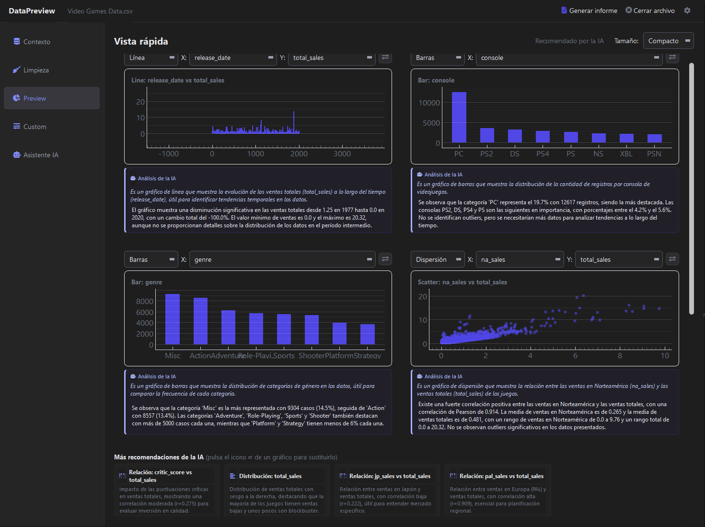
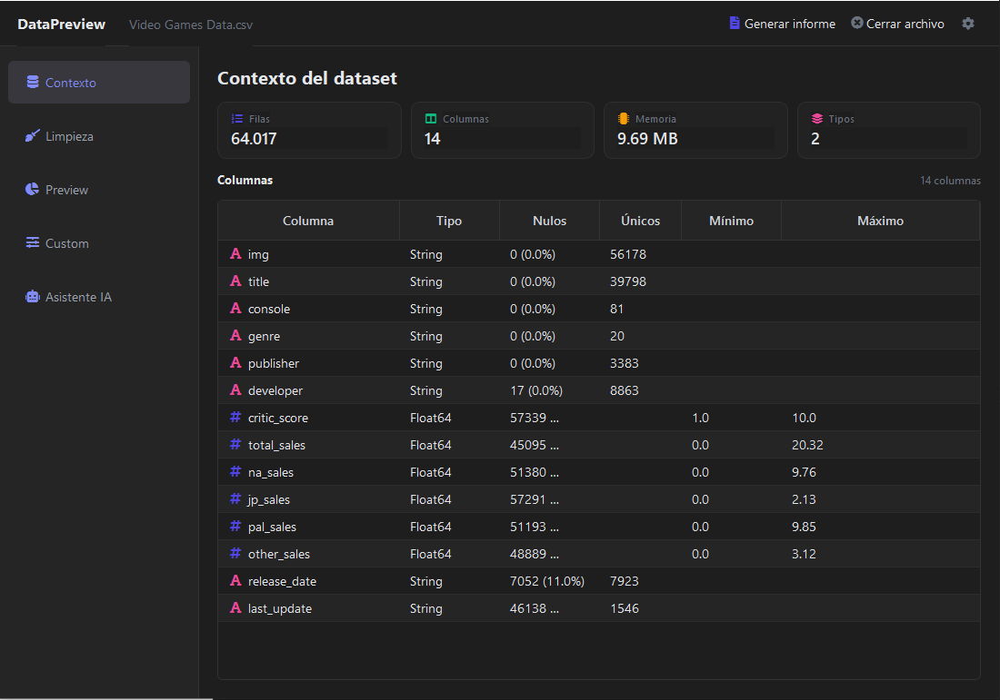
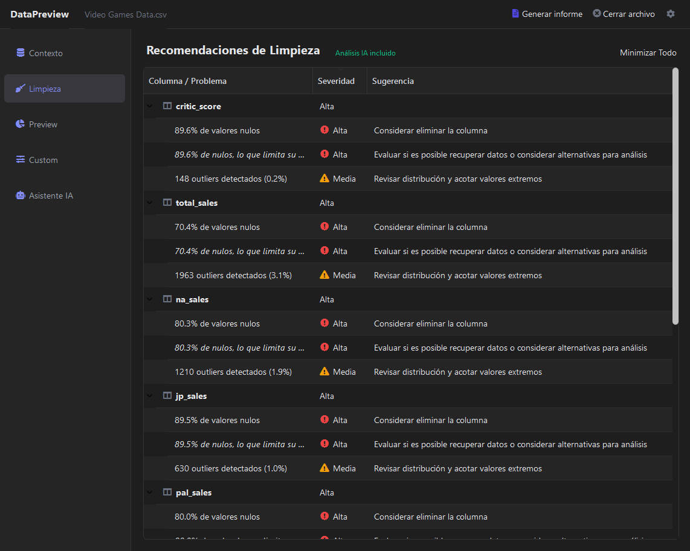
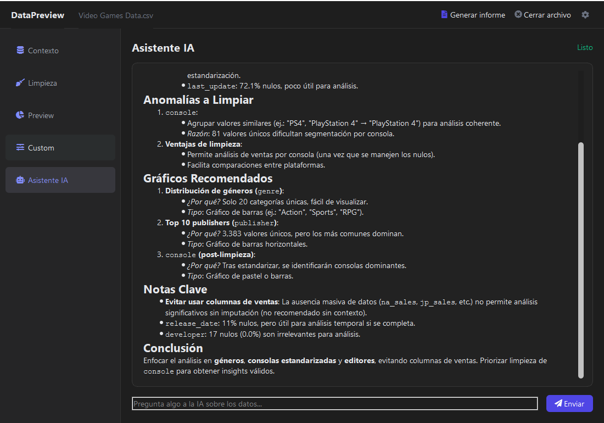
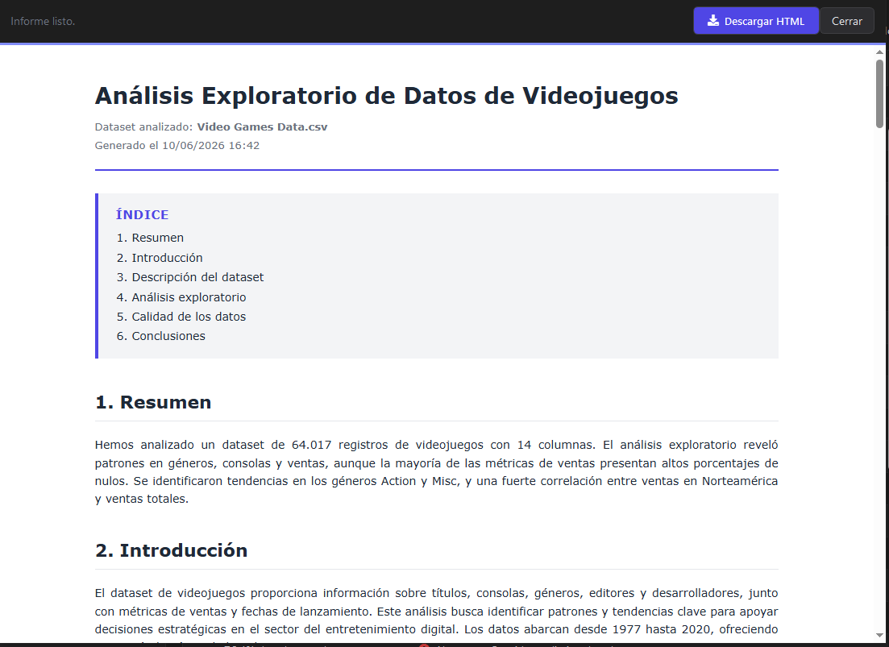

# DataPreview

Aplicación de escritorio en Python (PySide6) para hacer análisis exploratorio (EDA) de un dataset local — CSV, XLSX, JSON o Parquet — sin tener que escribir código. Combina recomendaciones automáticas de gráficos, un constructor manual de visualizaciones y un asistente de IA opcional que corre en tu propia máquina.
<p align="center">

</p>

## Qué hace

- **Cargar datos**: arrastra un archivo o haz click para seleccionarlo. Soporta CSV, XLSX, JSON, Parquet. Lectura por chunks con barra de progreso para datasets grandes.
- **Contexto**: tarjetas con filas, columnas, memoria, tipos. Tabla redimensionable de columnas con iconos por tipo. Si añades un diccionario de tus datos, se muestra como sección plegable.
- **Limpieza**: detección automática de problemas (nulos altos, outliers IQR, cardinalidad anómala) combinada con recomendaciones de IA cuando está disponible (tipos incorrectos, formatos heterogéneos, sentinelas, categorías casi duplicadas).
- **Preview**: hasta 6 gráficos recomendados con descripción y observaciones generadas por la IA. Selector de tipo + variables X/Y por panel. Alternativas swappables con un click. Scroll vertical, tamaño configurable.
- **Custom**: constructor manual con Plotly (Scatter, Línea, Barras, Histograma, Boxplot, Heatmap de correlación). Render asíncrono con loading state, análisis de la IA para cada gráfico generado.
- **Asistente IA**: chat conversacional sobre el dataset, con respuestas formateadas. Reporte inicial automático tras cargar los datos.

Todo lo de IA es **opcional**. Sin Ollama corriendo, la app sigue funcionando con heurísticas y simplemente oculta la pestaña Asistente IA.


## Capturas

**Contexto** — resumen del dataset y estadísticas por columna:



**Limpieza** — problemas detectados por heurísticas y por la IA:



**Asistente IA** — chat sobre los datos, corriendo en local:



**Informe** — exportación del análisis a HTML:




## Instalación rápida

```bash
git clone https://github.com/IvanAraque/DataPreview.git
cd DataPreview
python -m venv .venv
.venv\Scripts\activate          # Windows
# source .venv/bin/activate    # macOS / Linux
pip install -r requirements.txt
python src/app.py
```

Para activar la IA (opcional), instala [Ollama](https://ollama.com/) y descarga un modelo:
```bash
ollama pull qwen3:30b
```
Toda la inferencia ocurre en local — nada sale a internet.

Guía paso a paso, incluyendo cómo cambiar de modelo o generar un `.exe`: [`docs/INSTALL.md`](docs/INSTALL.md).


## Arquitectura

Si quieres entender cómo está estructurado el código (flujo de carga, integración con Ollama, threading, manejo de errores): [`docs/ARCHITECTURE.md`](docs/ARCHITECTURE.md).

Historial de versiones: [`docs/VERSION.md`](docs/VERSION.md).


## Stack

- **GUI**: PySide6 (Qt6) + QtWebEngine
- **Datos**: polars (núcleo), pandas (puente a Plotly)
- **Gráficos**: pyqtgraph (rápido, para Preview) + plotly (interactivo, para Custom)
- **IA local**: cliente HTTP propio contra Ollama (`/api/chat`)
- **Iconos**: qtawesome (FontAwesome)


## Licencia

MIT. Ver [`LICENSE`](LICENSE).
